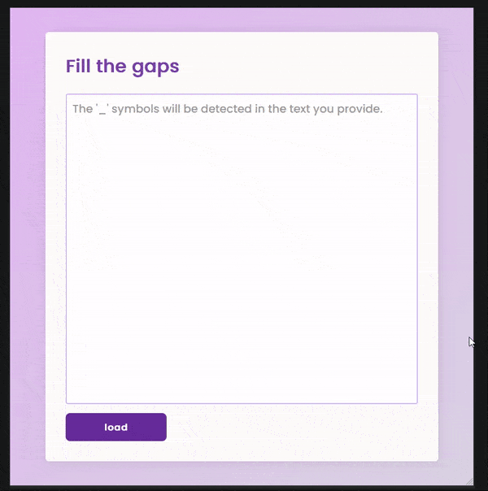
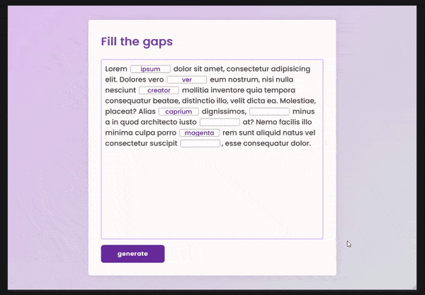

# Fill The Gaps

## Description
Fill The Gaps allows user modify text/file that contain gaps symbolised as `___`. Then user can export this as word file, and his answers will be marked (underlined and bold).

## App story 🍝
My goal was to simplify student job which excersises were created as text with gaps marked with `___`.

## Responsive

## Usage
* you can generate word file with ___ easily, just write text, mark gaps as _, and generate it without filling gaps,
      then your students can come with this and fill it easily.
* 

## TO DO 
* [X] review HTML5 syntax
* [X] review javascript 
* [x] css remake
* [ ] dark theme

## New idea 💡
tutaj napisz przyszłą wizję tego programu
    * sent it to your student -> ktoś tworzy tekst z ___ i potem tylko wysyła taki do uzupełnienia.
